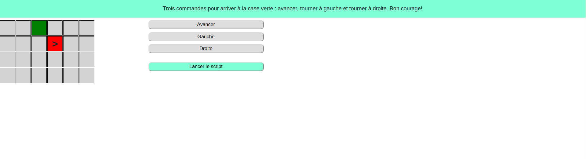

## SITE: https://air-one-x.github.io/programmer-game/

# programer-game

- Mise en place d'un mini-jeu de programmation, consistant à déplacer une flèche d'une case à une autre, par le biais d'un interpréteur.
- Apparition d'un message en cas de réussite ou d'échec.
- Rafraichissement automatique de la page après le résultat. 
- Point de départ et d'arrivée aléatoire.
- cliquez sur les directions de votre choix, modifiez les si besoins en cliquant sur votre tableau de direction et enfin lancez le script.
- Vidéo de démonstration : https://github.com/air-one-x/programmer-game/blob/master/programer_Trim.mp4

##### Javascript
##### HTML
##### CSS
